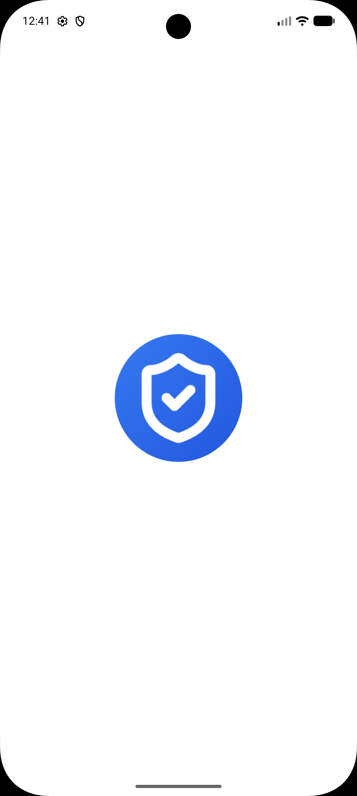
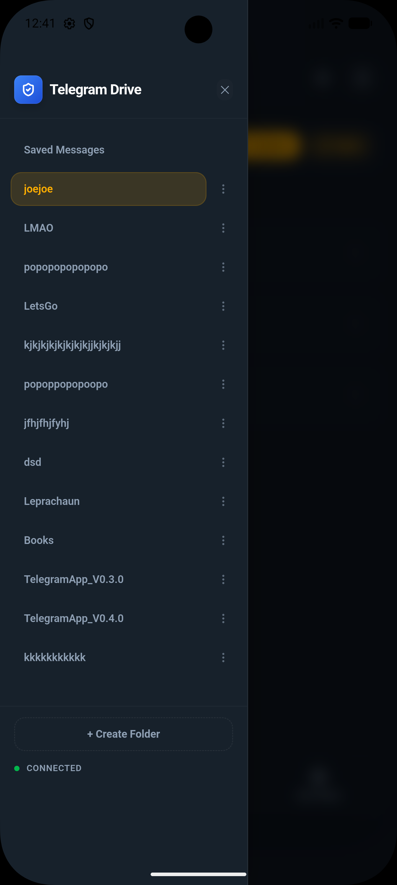

# Telegram Drive

**Telegram Drive** 是一款开源、跨平台的桌面应用，它能把你的 Telegram
账号变成无限容量、安全可靠的云存储网盘。基于 **Tauri**、**Rust** 和
**React** 构建。

<div align="center">

[](LICENSE)
[]()

[](https://oosmetrics.com/repo/caamer20/Telegram-Drive)
[](https://oosmetrics.com/repo/caamer20/Telegram-Drive)
[](https://oosmetrics.com/repo/caamer20/Telegram-Drive)

</div>


##  什么是 Telegram Drive？

Telegram Drive 借助 Telegram API，让你能够直接在 Telegram 的服务器上上传、整理和管理文件。它把你的“已保存的消息”以及你创建的频道当作文件夹，为你的 Telegram 云存储提供熟悉的文件管理器界面。

###  核心功能

*   **无限云存储**：充分利用 Telegram 慷慨的云端基础设施。
*   **高性能网格视图**：虚拟滚动技术可瞬间加载包含数千个文件的文件夹。
*   **自动更新**：Windows、macOS 和 Linux 平台均可无缝更新。
*   **媒体流播放**：无需下载即可直接在线播放视频和音频文件。
*   **PDF 阅读器**：内置 PDF 支持，配合无限滚动，带来流畅的文档阅读体验。
*   **拖放操作**：直观的拖放式上传与文件管理。
*   **缩略图预览**：为图片和媒体文件提供内嵌缩略图。
*   **文件夹管理**：创建“文件夹”（即私有 Telegram 频道）来整理内容。
*   **可分享链接**：生成直接下载链接，可选密码保护与有效期，并可随时在控制台中撤销访问权限。同时支持为公开频道中的文件复制原生 Telegram 消息链接。
*   **面向 AI 集成的 REST API**：安全的本地 API（默认关闭），支持自定义端口和 API 密钥认证。提供 OpenAPI 规范，便于与大语言模型及各类工具无缝集成。
*   **代理支持**：原生集成 SOCKS5 和 MTProto 代理，可绕过区域限制并保护你的流量安全。
*   **VPN 优化器**：提供激进的网络调优，包括带宽限速、可调整的传输分块大小，以及自适应保活机制，确保在高延迟连接下也能保持最大稳定性。
*   **注重隐私**：API 密钥和数据均保存在本地，不经过任何第三方服务器。
*   **跨平台**：为 macOS（Intel/ARM）、Windows、Linux 和 Android 提供原生应用。

## Android（预编译、未签名 APK）

通过 [v2.1.5-android 版本发布页](https://github.com/caamer20/Telegram-Drive/releases/tag/Androidv2.1.5beta) 可获取一个预编译的 **未签名 APK**，用于 Android 旁加载（sideloading）安装。

> [!WARNING]
> 该 APK **未经签名**，且 **未在 Google Play 商店上架**。你必须在设备上启用“允许安装未知来源应用”才能安装它。此版本包含 **Google AdMob 横幅广告**，用以支持项目开发。

### 如何旁加载安装

1. 从 [v2.1.5-android 版本发布页](https://github.com/caamer20/Telegram-Drive/releases/tag/Androidv2.1.5beta) 下载 `Telegram-Drive-v2.1.0-beta.apk`。
2. 在你的 Android 设备上，进入 **设置 → 应用 → 特殊应用权限 → 安装未知应用**，并允许你的浏览器或文件管理器进行安装。
3. 打开已下载的 APK 并点击 **安装**。
4. 首次启动时输入你的 Telegram API 凭据（与桌面版应用相同）。

> [!NOTE]
> - **兼容性**：需要 **Android 7.0（API 级别 24）** 或更高版本。
> - **Android 15+ 安装**：如果在 Android 15+ 模拟器/设备上安装时遇到拦截或安全限制，可使用 ADB 绕过：
>   ```bash
>   adb install --bypass-low-target-sdk-block Telegram-Drive-v2.1.0-beta.apk
>   ```
> - Android 版本属于 **社区/测试版**，在本地编译构建。桌面版应用（Windows/macOS/Linux）仍是主要支持的平台，由 GitHub CI 自动构建和签名。

---

##  应用截图

### 桌面版应用

| 主面板 | 文件预览 |
|-----------|--------------|
|  |  |

| 网格视图 | 登录认证 |
|-----------|----------------|
|  |  |

| Audio Playback | Video Playback |
|----------------|----------------|
|  |  |

| Auth Code Screen | Upload Example |
|------------------|-------------|
|  |  |

| Folder Creation | Folder List View |
|-----------------|------------------|
|  |  |

### Android 版应用

| Home Screen | Splash Screen | Dark Mode Folder View |
|-------------|---------------|-----------------------|
|  |  |  |

| Folder List | Transfer Queue | Settings Page |
|-------------|----------------|---------------|
|  |  |  |

##  技术栈

*   **前端**：React、TypeScript、TailwindCSS、Framer Motion
*   **后端**：Rust（Tauri）、Grammers（Telegram 客户端）
*   **构建工具**：Vite


##  快速开始

### 环境要求

*   **Node.js（v18+）**：[点此下载](https://nodejs.org/)
*   **Rust（最新稳定版）**：编译 Tauri 后端所需。通过 [rustup](https://rustup.rs/) 安装：
    *   **macOS/Linux：** `curl --proto '=https' --tlsv1.2 -sSf https://sh.rustup.rs | sh`
    *   **Windows：** 从 [rustup.rs](https://rustup.rs/) 下载并运行 `rustup-init.exe`
    *   *验证安装：* 在终端中运行 `rustc --version` 和 `cargo --version`。
*   **Tauri 所需的特定操作系统构建工具**：
    *   **macOS：** Xcode 命令行工具（`xcode-select --install`）。
    *   **Linux（Ubuntu/Debian）：** `sudo apt update && sudo apt install libwebkit2gtk-4.1-dev build-essential curl wget file libxdo-dev libssl-dev libayatana-appindicator3-dev librsvg2-dev`
    *   **Windows（关键）：** 你**必须**安装 [Visual Studio Build Tools](https://visualstudio.microsoft.com/visual-cpp-build-tools/)。在安装过程中，请选择 **“使用 C++ 的桌面开发”**（Desktop development with C++）工作负载。否则你会遇到 `linker 'link.exe' not found` 错误。
    *   **Windows（WebView2）：** Windows 10/11 用户通常已预装。如果没有，请下载 [WebView2 运行时](https://developer.microsoft.com/en-us/microsoft-edge/webview2/#download-section)。
    *   *参考：* 详细说明请查阅官方 [Tauri v2 环境要求指南](https://v2.tauri.app/start/prerequisites/)。
*   **Telegram API 凭据**：你需要拥有自己的 API ID 和 API Hash 才能与 Telegram 的服务器通信。
    1. 登录 [my.telegram.org](https://my.telegram.org)。
    2. 进入 “API development tools”，创建一个新的应用以获取你的 `api_id` 和 `api_hash`。

> [!NOTE]  
> **首次构建编译时间：** 初次构建（`npm run tauri dev` 或 `npm run tauri build`）会下载并编译 300 多个 Rust crate。此过程根据你的硬件配置可能耗时 **5 到 15 分钟**。后续构建会快得多。

> [!TIP]
> **NPM 漏洞警告：** 你在执行 `npm install` 时可能会看到漏洞警告。它们通常与构建工具和开发依赖项有关。你可以选择运行 `npm audit fix`，但这并非运行该应用的必要步骤。

### 安装

1.  **克隆仓库**
    ```bash
    git clone https://github.com/caamer20/Telegram-Drive.git
    cd Telegram-Drive
    ```

2.  **安装依赖**
    ```bash
    cd app
    npm install
    ```

3.  **以开发模式运行**
    ```bash
    npm run tauri dev
    ```

4.  **构建/编译**
    ```bash
    npm run tauri build
    ```

##  开源与许可协议

本项目是 **自由开源软件（Free and Open Source Software）**。你可以自由地使用、修改和分发它。

基于 **MIT License** 授权。

---
*免责声明：本应用与 Telegram FZ-LLC 无任何关联。请负责任地使用，并遵守 Telegram 的服务条款。*

如果你想找一个专为 VPN 优化的版本，请查看这个仓库：
https://github.com/caamer20/Telegram-Drive-ForVPNs

<div align="center">
  <!-- PayPal -->
  <div style="margin: 15px 0;">
    <a href="https://www.paypal.me/Caamer20">
      
    </a>
    <div style="font-size: 14px; margin-top: 8px;">paypal.me/Caamer20</div>
  </div>

  <!-- Litecoin -->
  <div style="margin: 15px 0;">
    <a href="litecoin:ltc1q6wkr5ac4u0pxx4hx7xgwn0gsaku25ws0df73rp">
      
    </a>
    <div style="font-family: monospace; font-size: 13px; margin-top: 8px; word-break: break-all;">
      ltc1q6wkr5ac4u0pxx4hx7xgwn0gsaku25ws0df73rp
    </div>
  </div>

  <!-- Bitcoin -->
  <div style="margin: 15px 0;">
    <a href="bitcoin:bc1q5pt7m2fk6w0dzsnf6vvd5k6nw5k44785286ujy">
      
    </a>
    <div style="font-family: monospace; font-size: 13px; margin-top: 8px; word-break: break-all;">
      bc1q5pt7m2fk6w0dzsnf6vvd5k6nw5k44785286ujy
    </div>
  </div>
</div>
